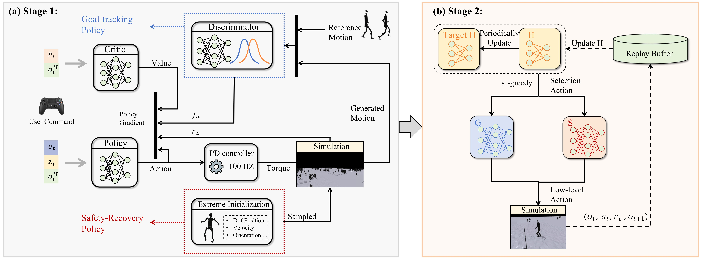

# HWC-Loco: A Hierarchical Whole-Body Control Approach to Robust Humanoid Locomotion

[Project Page](https://simonlinsx.github.io/HWC_Loco/) | [Paper](https://arxiv.org/abs/2503.00923) | [PDF](https://arxiv.org/pdf/2503.00923)

HWC-Loco is a research codebase for humanoid locomotion with motion-driven low-level control, recovery control, and a learned high-level selector policy. The repository contains Isaac Gym training code, motion preprocessing and retargeting utilities, and MuJoCo sim-to-sim deployment scripts.

The current release is centered on Unitree H1, with partial support for G1 in the environment and deployment code.



## Highlights

- Motion-conditioned humanoid control in Isaac Gym
- Separate low-level locomotion and recovery policies
- High-level selector policy for switching between behaviors
- Motion preprocessing and retargeting utilities built on top of `ASE/poselib`
- MuJoCo sim-to-sim deployment scripts

## Repository Structure

```text
HWC_Loco/
├── ASE/                # motion preprocessing, retargeting, and ASE-based utilities
├── legged_gym/         # humanoid environments, training, evaluation, and export scripts
├── rsl_rl/             # PPO implementations and training runners
├── mujoco/             # MuJoCo deployment scripts and configs
├── Pipeline.png        # overview figure
├── usage.md            # internal experiment notes and command history
├── req.yaml            # local pip snapshot
└── environment.yaml    # local conda environment snapshot
```

## Requirements

This project is developed for:

- Linux
- Python 3.8
- NVIDIA GPU
- CUDA-compatible PyTorch
- Isaac Gym Preview 4

Recommended base versions:

- `python==3.8`
- `torch==1.10.0+cu113`
- `torchvision==0.11.1+cu113`
- `torchaudio==0.10.0+cu113`

Notes:

- `environment.yaml` is a local development snapshot and should not be treated as the final public reproduction environment without cleanup.
- Raw motion preprocessing from `.fbx` files additionally requires the Autodesk FBX SDK.

## Installation

Create a clean environment:

```bash
conda create -n hwc_loco python=3.8
conda activate hwc_loco
```

Install PyTorch:

```bash
pip install torch==1.10.0+cu113 torchvision==0.11.1+cu113 torchaudio==0.10.0+cu113 \
  -f https://download.pytorch.org/whl/cu113/torch_stable.html
```

Install Isaac Gym Preview 4 manually from NVIDIA, then install its Python package:

```bash
cd <ISAAC_GYM_ROOT>/python
pip install -e .
```

Install local packages:

```bash
cd rsl_rl
pip install -e .

cd ../legged_gym
pip install -e .
cd ..
```

Install additional dependencies:

```bash
pip install -r ASE/requirements.txt
pip install -r legged_gym/requirements.txt
pip install mujoco==3.2.3 gdown dill flask ipdb pyfqmr
```

If you do not want online logging during training, add:

```bash
--no_wandb
```

## Motion Data Preparation

The H1 pipeline relies on motion preprocessing and retargeting tools under `ASE/ase/poselib`.

### 1. Prepare raw motion files

Download the source FBX motion files and place them in:

```text
ASE/ase/poselib/data/cmu_fbx_all/
```

### 2. Generate motion config files

```bash
cd ASE/ase/poselib
python parse_cmu_mocap_all.py
```

### 3. Import FBX motions

```bash
python fbx_importer_all.py
```

### 4. Retarget motions to H1

```bash
mkdir -p data/pkl data/retarget_npy
python retarget_motion_h1_all.py
```

### 5. Generate key-body annotations

This step uses simulation to produce key-body information for the retargeted motions:

```bash
cd ../../legged_gym/legged_gym/scripts
python train.py debug --task h1_view --motion_name motions_debug.yaml --debug
python play.py debug --task h1_view --motion_name motions_autogen_all.yaml
cd ../../..
```

## Training

All main training scripts are under:

```text
legged_gym/legged_gym/scripts/
```

### Goal Tracking Policy

```bash
cd legged_gym/legged_gym/scripts

python train.py goal_tracking \
  --task h1_command_amp \
  --motion_task walk \
  --motion_name motions_autogen_human_walk_and_run.yaml \
  --motion_type yaml \
  --sim_device cuda:0 \
  --rl_device cuda:0 \
  --seed 42 \
  --headless \
  --proj_name h1
```

### Recovery Policy

```bash
python train.py recovery \
  --task h1_command \
  --motion_task recovery \
  --motion_name motions_autogen_human_walk_and_run.yaml \
  --motion_type yaml \
  --sim_device cuda:0 \
  --rl_device cuda:0 \
  --seed 42 \
  --headless \
  --proj_name h1
```

### Export Low-Level Policies as JIT

```bash
python save_jit.py --exptid goal_tracking --checkpoint <GOAL_TRACKING_CKPT>
python save_jit.py --exptid recovery --checkpoint <RECOVERY_CKPT>
```

### Train the Selector Policy

```bash
python train_selector.py selector_h1 \
  --task h1_selector \
  --motion_task walk \
  --motion_name motions_autogen_human_walk_and_run.yaml \
  --motion_type yaml \
  --sim_device cuda:0 \
  --rl_device cuda:0 \
  --seed 42 \
  --proj_name h1 \
  --loco_jit <LOCOMOTION_JIT_PATH> \
  --reco_jit <RECOVERY_JIT_PATH>
```

## Evaluation

### Evaluate Goal Tracking

```bash
python play.py goal_tracking \
  --task h1_command_amp \
  --motion_task walk \
  --motion_name motions_autogen_human_walk_and_run.yaml \
  --proj_name h1 \
  --sim_device cuda:0 \
  --rl_device cuda:0 \
  --checkpoint <GOAL_TRACKING_CKPT> \
  --record_video \
  --headless
```

### Evaluate Recovery

```bash
python play.py recovery \
  --task h1_command \
  --motion_task recovery \
  --motion_name motions_autogen_human_walk_and_run.yaml \
  --proj_name h1 \
  --sim_device cuda:0 \
  --rl_device cuda:0 \
  --checkpoint <RECOVERY_CKPT> \
  --record_video \
  --headless
```

### Evaluate the High-Level Selector

```bash
python play_selector_jit.py selector_eval \
  --task h1_selector \
  --motion_task walk \
  --sim_device cuda:0 \
  --rl_device cuda:0 \
  --headless \
  --record_video \
  --num_envs 1 \
  --selector_path <SELECTOR_CKPT_PATH> \
  --loco_jit <LOCOMOTION_JIT_PATH> \
  --reco_jit <RECOVERY_JIT_PATH>
```

## MuJoCo Sim-to-Sim

MuJoCo deployment utilities are provided in `mujoco/`.

Install MuJoCo:

```bash
pip install mujoco==3.2.3
```

Run deployment:

```bash
cd mujoco
python mujoco_deploy_g1.py
cd ..
```

Before running sim-to-sim, update the policy path in the MuJoCo config file to point to the exported model.

## Reproducibility Notes

This repository was developed through active research iteration. Before claiming full reproduction support, users should be aware that:

- simulator, CUDA, and PyTorch versions matter
- raw motion preprocessing depends on the FBX SDK
- `usage.md` reflects development-time experiment history rather than a polished release tutorial
- public reproduction may require adapting environment details to the target machine

## License and Asset Notice

This repository contains components and assets under different licenses.

- `legged_gym/` and `rsl_rl/` contain BSD-style licensed components
- `ASE/` includes code released under the NVIDIA license in `ASE/LICENSE.txt`, which restricts usage to non-commercial research or evaluation
- bundled motion assets under `ASE/ase/data/motions/reallusion_sword_shield/` are marked for non-commercial use only
- additional robot description assets may carry their own licenses in their respective subdirectories

Please read all relevant license files before using, redistributing, or modifying this repository.

## Acknowledgements

This project builds on top of several excellent open-source and research codebases, including:

- `legged_gym`
- `rsl_rl`
- `ASE`
- MuJoCo
- Unitree robot description assets

We thank the original authors and maintainers of these projects.

## Citation

If you find this repository useful in your research, please cite:

```bibtex
@article{lin2025hwc,
  title={HWC-Loco: A Hierarchical Whole-Body Control Approach to Robust Humanoid Locomotion},
  author={Lin, Sixu and Qiao, Guanren and Tai, Yunxin and Li, Ang and Jia, Kui and Liu, Guiliang},
  journal={arXiv preprint arXiv:2503.00923},
  year={2025}
}
```